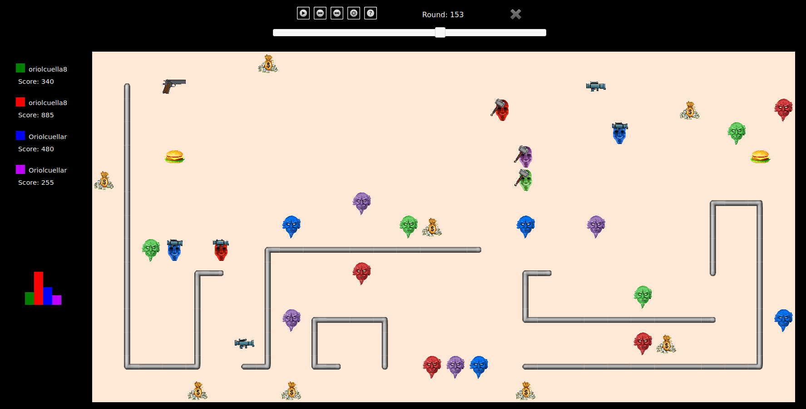

# juego-EDA

# Compilar
  make all
  (compila todos los archivos .cc que comiencen con AI.
  
# Jugar

  - los ficheros .cc se llaman AIOriolCuellar.cc AI...
  - el numero despues de -s es la semilla con la que se crea la partida
  - default.cnf es el mapa que se utiliza
  - default.res es el fichero donde se guarda la ejecucion
  
  ## 1 partida: 
  
    ./Game OriolCuellar OriolCuellar OriolCuellar OriolCuellar -s 1 < default.cnf > default.res
    
    Los 4 jugadores son la misma version
    
  ## 1000 partidas
  
     en el fichero FIB cambiar la linea de partida
     
     para ver las estadisticas:
      - ejecutar python3 juntar.py (juntara los resultados de las 1000 partidas en un fichero)
      - abrir aa_grande.txt y pegar en el documento excel. Las estadisticas son de los jugadores en pos 2 y 3
     
# Ver partidas
  carpeta viewer -> abir viewer.html -> abrir el .res (partida)

